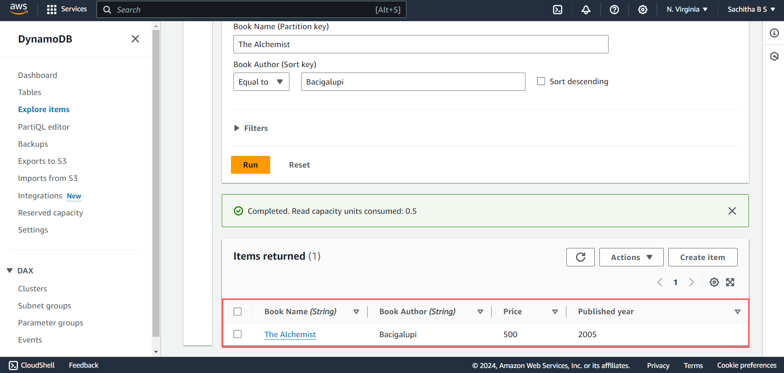
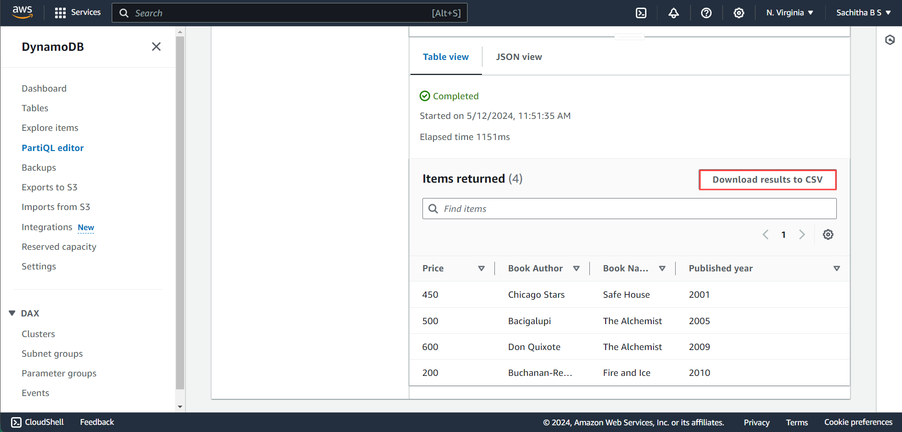
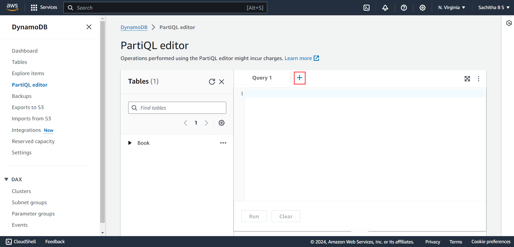
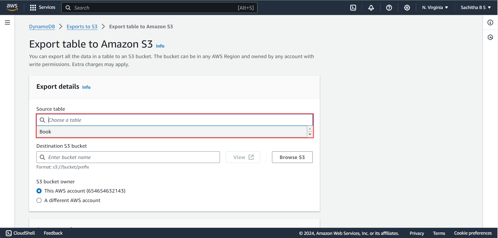

# Getting started with AWS DynamoDB
---
**Lab Duration : 1 hour**

Follow the Steps below to start with the lab

***Step1**: Signing In to the console*
1. Open the browser and navigate to [AWS Management Console](https://console.aws.amazon.com/).

2. Provide the credentials **AccountId, Username, Password**
3. **SignIn link, Username and Password** are available in the Environment Tab of cloud Labs

***Step 2**: Region Selection and Navigate to the DynamoDB service*
1.  Once login is succesfull you will be directed to the aws console
2.  Choose the desired region from the drop down menu where you intend to utilize the service.
    You can utilize the service in any of the following regions:
    * us-east-1
    * us-east-2
    * us-west-1
    * us-west-2
    * ap-south-1 

 

3. In the search bar,search for the service by typing its name and click on the service from the result section

 

---

# Introduction to Amazon DynamoDB 
---
## Overview

Amazon DynamoDB is a fully managed NoSQL database service that provides fast and predictable performance with seamless scalability. You can use Amazon DynamoDB to create a database table that can store and retrieve any amount of data, and serve any level of request traffic. Amazon DynamoDB automatically spreads the data and traffic for the table over a sufficient number of servers to handle the request capacity specified by the customer and the amount of data stored, while maintaining consistent and fast performance

### Core Components

1. **Tables**:
    -  Each table is a collection of items, similar to a table in a relational database.
    - Tables in DynamoDB are schema-less, meaning each item in the table can have different attributes, and attributes can vary in type.
    - Tables are organized based on primary keys, which uniquely identify each item in the table.
2. **Items**:
    - Items are individual records stored within a DynamoDB table. They represent a single data record or entity.
    - Each item consists of one or more attributes, which are the data fields or properties associated with the item.
    - Items can have different attributes, and there is no fixed schema for items within a table.
3. **Attributes:**
    - Attributes are the individual data fields or properties of an item in a DynamoDB table.
    - Each attribute has a name and a value. Attributes can be of various data types, including string, number, binary, Boolean, list, or map.
    - Attributes can be indexed for efficient querying and retrieval of data.
4. **Primary Keys:**
    - Every item in a DynamoDB table must have a primary key, which uniquely identifies the item within the table.
    - DynamoDB supports two types of primary keys:
        * Partition Key: A single attribute that uniquely identifies each item in the table. 
        * Composite Key: A combination of two attributes: a partition key (hash key) and a sort key (range key). Together, they uniquely identify each item in the table.

## Key Learnings:

- Understanding Amazon DynamoDB as a fully managed NoSQL database service.
- Learning about core components like tables, items, attributes, and primary keys.
- Exploring table creation, adding items, querying, and exploring DynamoDB with PartiQL queries.
- Exploring advanced features like backups, exporting data to Amazon S3
- Learning about table configurations, including indexes, monitoring, and global tables.
- Understanding various  table operations like item modification, deletion, and table deletion.

## Hands-on Labs:

- [Exercise 1](#exercise-1-table-creation): Table Creation
- [Exercise 2](#exercise-2-adding-items-to-the-created-table): Adding Items to the Created Table
- [Exercise 3](#exercise-3-quering-the-items-in-the-table): Querying Items in the Table
- [Exercise 4](#exercise-4-exploring-dynamodb-with-partiql-queries): Exploring DynamoDB with PartiQL Queries
- [Exercise 5](#exercise-5-creating-backups-for-tables): Creating Backups for Tables
- [Exercise 6](#exercise-6-exporting-the-data-to-amazon-s3): Exporting Data to Amazon S3
- [Exercise 7](#exercise-7-exploring-table-configurations): Exploring Table Configurations
- [Exercise 8](#exercise-8-exploring-table-operations): Exploring Table Operations (Item Modification, Deletion, Table Deletion)

---

# **Exercise 1: Table Creation**
---
1. Once the Service is located you will be directed to the **DynamoDB** Homepage
2. In order to create Table click on **Create Table** as shown below

  

3. Specify the table details for creating the table. Enter the table name

  

4. Provide the partition key Name and its corresponding type .Type can be selected through the drop down 

 

5. Sort Key can also be utilized for creating primary key .But its optional unless you know the data in the partition key is not repeated. Provide the Sort key name and its corresponding type.

 

6. Under **Table Setting** Keep the default Settings

 

7. After Specifying the details, Scroll down and click on **Create Table**

 

# **Exercise 2: Adding Items to the created table**
---
1. Once you have created the table you get to see that the table has been created and all its configurations can be seen as below

2. To Add the item ,Click on **Explore items** in the left navigation pane of console

3. On the **Tables Page**, Select the table created

4. In the **Items Returned Page**, Click on **Create Item**

5. You are now redirected to **Create Item** page, Enter the Attribute Values based on the type.
    - Book Name
    - Book Author

6. To add Additional Attribute apart from the Existing Attribute, Click on **Add New Item** where you need to first select the type of the attribute

7. Enter the Attribute name and its Type. Repeat the process to add more attribute as mentioned in **Step 6** 

8. Click on **Create Item** for adding the item into the table.

9. In **Items Returned** page one item will be inserted. To add additional items click on **Create Item** and Repeat the procedure.

# Exercise 3: Quering the Items in the table
---
In order To Retrieve items from the table
<ul>
  1. Click on <b>Explore Items</b> in the left navigation pane 
  2. Select your table from tables tab 
  3. Then Expand <b>Scan or Query items</b>
</ul>

There are two different approches for Querying the items
- Scan
- Query

## Task 1: Querying through **Scan**

If **Scan** Option is Choosed, It retrieves all items in a table, which is suitable for retrieving data without specific criteria
For Example: To Retrieve the table items based on Author Attribute 

1. Select **Scan** Option   
2. Select the desired table name from the Drop down menu 

3. Choose the attribute projection based on the requirement, In order to retrieve items of all the attributes select **All attributes** or to retrieve based based on specific attribute select **specific attributes**.
 - *Retrieving based on All Attributes*: 
    1. Select  **All attributes** from the drop down
    2. Click on **Run** 

 
<ul>
    iii. The Result fetched will look as below
</ul>

 

- *Retrieving based on Specific attribute*: 
    1. First select the **specific attributes** from the drop down
    2. Choose the desired attribute name from the **Specific Attributes to project** 
    3. Click on **Add attribute**

 
<ul>
    iv. The selected Attribute name will be appeared  
    v. Click on <b>Run</b>
</ul>

 
<ul>
    vi. The Result fetched will look as below
</ul>

*Exploring Filters: Filters are always applied on the Data retrieved by Scan*
<ul>
    1. Choose <b>scan option</B>  
    2. Select the table from the Drop down 
    3. Select the attribute to which filter is to be applied
</ul>

<ul>
    4. Expand Filters
</ul>

<ul>
    5. Select the attribute on which the filter to be applied from the drop down 
    6. Select its corresponding type of the attribute selected 
    7. Select the Condition from the drop down  
    8. Enter the attribute value that you want to fetch 
</ul>

<ul>
    9. Click on <b>Run</b> 
</ul>

<ul>
    10. The Result Retrieved will be shown as below
</ul>

 

## Task 2: Querying through **Query** 

If the Query option is chosen, it retrieves items based on specific criteria defined by the query.

1. Choose **Query** Option   
2. Select the desired table name from the Drop down menu 

 

3. Choose the attribute projection based on the requirement, In order to retrieve items  all the attributes select All attributes or to retrieve based based on specific attribute select specific attributes.
- *Retrieving based on All Attributes*: 
    1. Select  **All attributes** from the drop down
    2. Enter the partition key value on which the details are retrieved
    3. Enter its corresponding sort key value
    4. Click on **Run** to fetch the result

<ul>
    v. The result retrieved will be shown as below
</ul>

- *Retrieving based on Specific attribute*: 
    1. First select the **specific attributes** from the drop down
    2. Choose the desired attribute name from the **Specific Attributes to project** 
    3. Click on **Add attribute**

  
<ul>
    iv. The Added attribute appears below.
</ul>

 
<ul>
    v. Enter the partition key value on the which the details are retrieved  
    vi. Enter  its corresponding sort key value  
    vii. Click on <b>Run</b>
</ul>

 

<ul>
   viii. Review the result.
</ul>

 

# **Exercise 4: Exploring DynamoDB with PartiQL Queries**

PartiQL allows you to run SQL-like queries against  DynamoDB tables, making it easier to interact with your data.

<ul>
  Click on <b>PartiQL editor</b> in the left navigation pane 
</ul>

 
There are two different approches for Querying the items
- Manual Query Writing
- Utilizing the table options for Enhanced Querying

## Task 1: Manual Query Writing
1. Write PartiQL query in the Query editor Tab .
For Example: The query written below is used to retrieve all the items from the Book Table

 
2. Click on **Run** to execute the Query

 
3. You can also download the retreived results

 

4. Query Modification
    1. Modifying the query can be done within the same query tab, and the results will be retrieved upon clicking **Run**.
    For Example: Retreiving the items based on specific attribute

 

<ul>
    ii. Modifying the query can also be done by adding new query tab(Click on <b>+</b> icon)  
    
</ul>

 

For Example: Retreiving the items based on specific attribute

 

## Task 2: Utilizing the table options for Enhanced Querying
1. Look for the table on which you want to Query the items

 

2. Click on the three dots (...) to access query options for the selected table.
3. Select **Scan Table** Option from the drop down

 

4. The query for scanning the table appears in Query editor
5. Then Click on **Run**

 

6. Review the results Fetched.

 

You can also view the Result in Json By clicking the **Json View**

 
 
 For More Enchanced quering, Explore the table options.

# **Exercise 5: Creating Backups for tables**
---

1. In the left navigation menu of the  console, click on **Backup** to access the backup management section.
2. Within the backup management section, click on the **Create backup** button.

3. Choose the table for which you want to create a backup from the list of available tables.

4. Specify any additional backup settings, You can either choose default Settings or You can cutomize the Backup settings

5. Click on **Create Backup** Button

6. Once the backup is succesfully created. You will receive the Confirmation message. 

7. The details of your Backup will be shown as below

# **Exercise 6: Exporting the data to Amazon s3**
---
Exporting data from DynamoDB to Amazon S3 allows you to store your DynamoDB table data in a file format that can be easily accessed and analyzed

1. In the left navigation menu of the  console, click on **Export to s3** 
2. To start the Exporting process, Click on the **Export to s3** button.

3. Select the table from the drop down menu which you want to export

4. Enter the Destination Bucket name. You can also browse the bucket name.

5. Keep all the **Export Setting** as Default.Scroll Down and then Click on **Export**

6. To Export the data, it is neccessary that PITR(Point-In-Time Recovery) for the table must be enabled. Click on **Turn on** and then click **Export**

7. Once the export process is successfully completed, a confirmation message will be displayed, and the details of the Export will be shown.

# **Exercise 7: Exploring Table Configurations**
---

1. In the left navigation pane, click on **Tables** to view a list of DynamoDB tables.

2. From the list of tables, click on the name of the table to explore its configurations.

 
3. Once you click on the name of the table, you will be navigated to the table details page where you can further explore and configure its settings and attributes.

**i. Overview** 
This section provides a general overview of table configurations like General information, Item Summary, Table capacity metrics

  

**ii. Indexes**
Global secondary indexes allow you to perform queries on attributes that are not part of the table's primary key. 

1. Click on <b>Create Index</b>

 

2. Enter the Partition Key name other than the already existing partition key ,Sort key is optional.

3. Keep all the other Index Setting as default, Scroll down and then Click on <b>Create Index</b>

 

4. The created global index with its details will be displayed in index page.

 

**iii. Monitor**

- Alarms in DynamoDB are your built-in surveillance system, keeping an eye on all the important stuff happening in tables.
- To set up alarms in CloudWatch, navigate to the CloudWatch service and explore the options for creating alarms.

 

**iv. Global Table**

Global table  is used to replicate a table across multiple AWS regions. This ensures that the same dataset is available and consistent across different geographical locations.
1. To replicate the table click on **Create Replica**

 

2. Select the region to which you want to replicate the table
3. Click on **Create Replica**

 

4. Upon successfull replication, the details we be displayed in the replica section of the console. 

 

# **Exercise 8: Exploring Table operations**
---
## Task 1: Item Modification and Deletion
1. In the left navigation pane on the console, Click on **Explore Items**
2. Select the table the you wish to update
3. Select the item on which the Operation is to be performed

 

4. Select **Edit item** from the **Actions** drop down menu

 

5. You will be directed to edit the item, once the value of the item is edited, Click on **Save and Close**

 

6. Select the item that you wish to delete and then select **Delete item** from the drop down menu. The item from the table will be deleted successfully.

 

## Task 2: Table Deletion
Before deleting the table, ensure that any replication of the table present in another region is terminated

1. In the left Navigation pane, Click on **Tables** 
2. Select the table name that you which delete by checking the box
3. Click on **Delete** Button

 

4. A popup is displayed to confirm the deletion process, 
type confirm and then Click on **Delete** Button

 

# Conclusion

Congratulations on successfully completing the DynamoDB lab! Throughout the exercises, you've explored various aspects of Amazon DynamoDB, from basic table creation to more advanced operations like querying, backups, and data export/import. 

   

 

        

 

 

    

 

